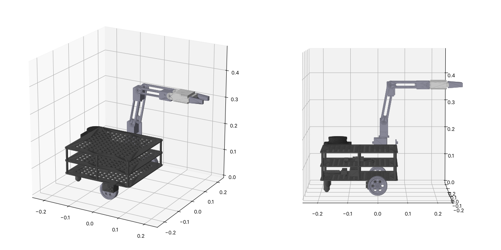

# Mobile Manipulator: TurtleBot3 (Waffle Pi) + OpenMANIPULATOR-X

CAD model and ROS 2 description of the robot only, with no workspace or environment, for the project
**"Collision-Free Motion Planning for Mobile Manipulator During Material Handling"**
(ROS 2 · MoveIt 2 · OMPL · Gazebo).



## Folder structure

```
TB3_OpenManipulatorX/
├── SolidWorks/
│   ├── Parts/                 16 individual parts (.STEP), each opens in SolidWorks 2025
│   ├── Assembly/              Full robot + base and arm sub-assemblies (.STEP)
│   ├── Parameters/            parameters.csv + SolidWorks_Global_Variables.txt
│   └── Macros/                Convert_STEP_to_Native_SolidWorks.bas (batch convert to .SLDPRT/.SLDASM)
├── URDF/
│   └── tb3_omx_description/   ROS 2 package (ament_cmake): urdf, xacro, STL meshes, launch, controllers
├── Preview/                   Rendered images
└── source/generate.py         Parametric generator for all CAD, meshes and URDF
```

## 1. Opening in SolidWorks 2025

**Full robot:** `File > Open`, set the file type to *STEP (\*.step;\*.stp)*, then pick
`SolidWorks/Assembly/TB3_OpenManipulatorX_Full_Assembly.STEP`. SolidWorks opens it as an **assembly**
with two sub-assemblies (`TurtleBot3_Waffle_Base` and `OpenManipulatorX_Arm`) and named, coloured components.
Use `File > Save As` to save it as `.SLDASM`.

**Single part:** open any file in `SolidWorks/Parts/`. It opens as a part; save it as `.SLDPRT`.

**Batch to native files:** run the macro in `SolidWorks/Macros/`. The steps are written at the top of the
`.bas` file. It writes every part and assembly to `SolidWorks/Native_SolidWorks_Files/`.

**Editable features:** the STEP files hold solid bodies. To get editable extrudes, cuts and holes in the
FeatureManager tree, open a part and run `Insert > FeatureWorks > Recognize Features` (Automatic).

**Global variables:** `Tools > Equations > Import` with `Parameters/SolidWorks_Global_Variables.txt`
loads every design dimension as a named global variable.

> Native `.SLDPRT` and `.SLDASM` files are a proprietary format that can only be written by SolidWorks itself. That is why
> the models ship as STEP (AP214) and the macro converts them inside SolidWorks.

### Parts list

| # | Part | Qty in robot | Notes |
|---|------|---:|-------|
| 01 | TB3_Waffle_Plate | 3 | 266 × 250 × 3 mm, waffle hole grid |
| 02 | TB3_Standoff | 12 | hex, 45 mm |
| 03 | Dynamixel_XM430 | 6 | 2 wheel drives + 4 arm joints (28.5 × 46.5 × 34) |
| 04 | TB3_Wheel | 2 | Ø66 × 18 mm with tyre |
| 05 | TB3_Ball_Caster | 2 | Ø16 ball |
| 06 | LiPo_Battery | 1 | 89 × 35 × 27 |
| 07 | OpenCR_Board | 1 | 105 × 75 |
| 08 | Raspberry_Pi_Board | 1 | 85 × 56 |
| 09 | LDS_Lidar | 1 | LDS-01 envelope |
| 10 | Pi_Camera_Bracket | 1 | camera + L bracket |
| 11 | OMX_Base_Flange | 1 | arm mounting plate |
| 12 | OMX_Link2_Bracket | 1 | U-bracket on joint 1 |
| 13 | OMX_Link3_Frame | 1 | upper arm (side plates) |
| 14 | OMX_Link4_Frame | 1 | forearm (side plates) |
| 15 | OMX_Gripper_Body | 1 | wrist / palm |
| 16 | OMX_Gripper_Finger | 2 | parallel gripper fingers |

### Key parameters (mm)

| Parameter | Value | Parameter | Value |
|---|---|---|---|
| Wheel radius | 33 | Wheel separation | 288 |
| Plate L × W × t | 266 × 250 × 3 | Standoff height | 45 |
| Base height (ground → top plate) | 146.25 | Arm mount (x, z) in base_link | (10, 156.25) |
| Joint1 offset | (12, 0, 17) | Joint2 offset | (0, 0, 59.5) |
| Joint3 offset | (24, 0, 128) | Joint4 offset | (124, 0, 0) |
| Gripper offset | (81.7, ±21, 0) | End effector | (126, 0, 0) |

The full list is in `SolidWorks/Parameters/parameters.csv`. Arm offsets and joint limits match the official
ROBOTIS OpenMANIPULATOR-X description. Wheel radius, track width and base height follow TurtleBot3 Waffle Pi.

## 2. ROS 2 package (`URDF/tb3_omx_description`)

Copy the package into your `src/` folder, then:

```bash
colcon build --packages-select tb3_omx_description
source install/setup.bash

# RViz with joint sliders
ros2 launch tb3_omx_description display.launch.py

# Gazebo (gz sim) + ros2_control
ros2 launch tb3_omx_description gazebo.launch.py
```

* `urdf/tb3_omx.urdf.xacro` is the main description. Joint limits, wheel radius and separation are xacro properties.
  Pass `use_gazebo:=true` to add the ros2_control, sensor and friction tags from `tb3_omx.gazebo.xacro`.
* `urdf/tb3_omx.urdf` is the same robot as plain URDF, without the Gazebo tags.
* Meshes are STL in mm, loaded with `scale="0.001 0.001 0.001"`. Each link mesh is already in its own link
  frame. Inertias are computed from the CAD geometry and scaled to the real link masses.
* Gazebo controllers (`config/controllers.yaml`):
  * `diff_drive_controller` takes `/diff_drive_controller/cmd_vel`.
  * `arm_controller` is a JointTrajectoryController for `joint1`–`joint4`, ready for MoveIt 2.
  * `gripper_controller` is a JointTrajectoryController for `gripper_left_joint`.
  * `joint_state_broadcaster` publishes the joint states.
* Gazebo sensors are bridged to `/scan`, `/imu`, `/camera/image_raw` and `/clock`.

### Kinematic tree

```
base_footprint
└─ base_link
   ├─ wheel_left_link / wheel_right_link   (continuous)
   ├─ caster_back_left_link / caster_back_right_link
   ├─ imu_link, base_scan (lidar), camera_link
   └─ link1 (arm base, fixed)
      └─ joint1 → link2 → joint2 → link3 → joint3 → link4 → joint4 → link5
                                                                     ├─ gripper_left_joint  → gripper_left_link  (prismatic)
                                                                     ├─ gripper_right_joint → gripper_right_link (mimic)
                                                                     └─ end_effector_link
```

For MoveIt 2, run the MoveIt Setup Assistant on `tb3_omx.urdf.xacro`. Create a planning group `arm` with
`joint1`–`joint4` (chain `link1` → `end_effector_link`) and a group `gripper`. OMPL's RRT, RRTstar and PRM are
then available to compare.

## 3. Changing the design

```bash
pip install cadquery
python source/generate.py
```

Edit the `PARAMETERS` block at the top of `generate.py`. One run regenerates every STEP part, the assemblies,
the parameter files, the STL meshes and the URDF/xacro, so the CAD and the URDF always match.
