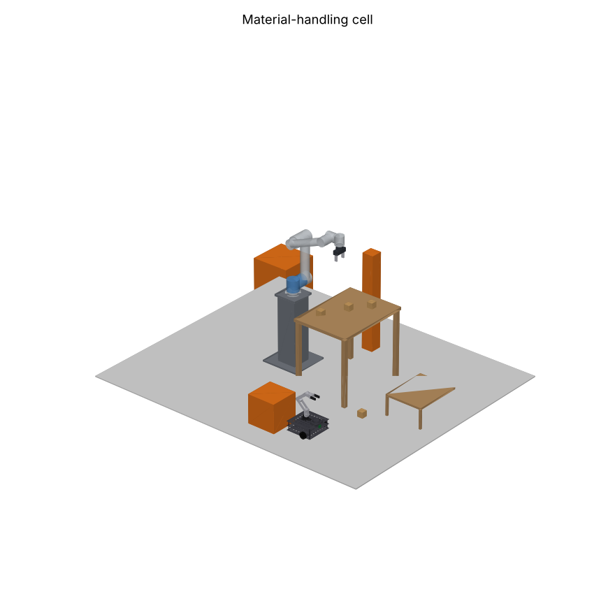
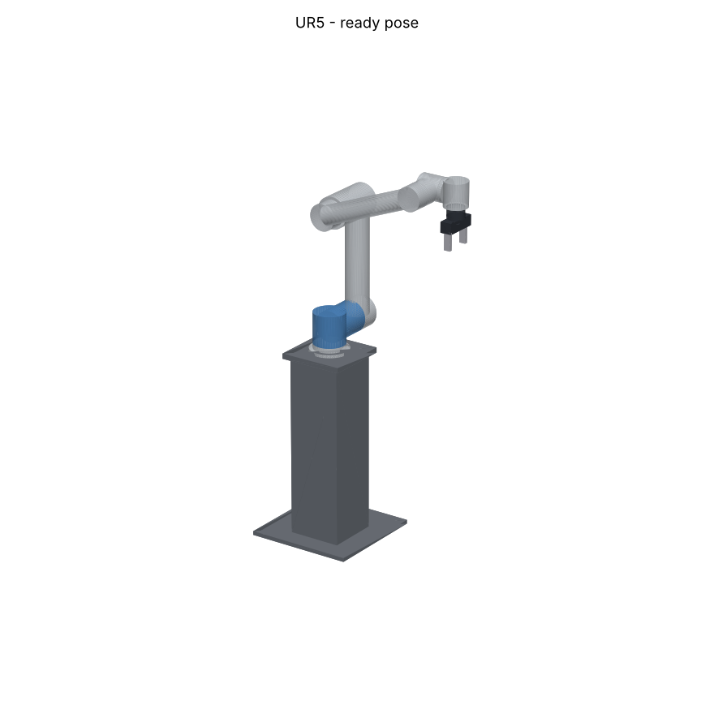
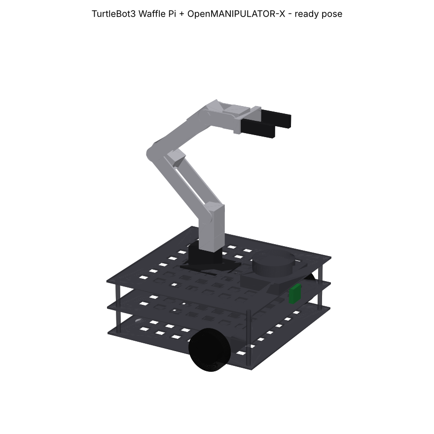

# Collision-Free Motion Planning for Mobile Manipulator During Material Handling

CAD models and ROS 2 simulation packages for the two robots in this project:

| Role | Robot | ROS 2 package |
|---|---|---|
| Fixed manipulator | **UR5** (6-DOF, Universal Robots) on a 0.7 m pedestal, with a 2-finger gripper | `ur5_description` |
| Mobile manipulator | **TurtleBot3 Waffle Pi + OpenMANIPULATOR-X** | `tb3_omx_description` |



| UR5 | TurtleBot3 + OpenMANIPULATOR-X |
|---|---|
|  |  |

## Folder layout

```
solidworks/                              <- open these in SolidWorks 2025
  UR5_Fixed_Manipulator/
    parts/*.STEP                         22 separate parts
    UR5_Fixed_Manipulator_assembly.STEP  full assembly
  TB3_OpenManipulatorX/
    parts/*.STEP                         36 separate parts
    TB3_OpenManipulatorX_assembly.STEP   full assembly
  Material_Handling_Cell_assembly.STEP   both robots + table, shelf, obstacles

ros2_ws/src/
  ur5_description/                       same layout as the SolidWorks-to-URDF exporter
  tb3_omx_description/
    CMakeLists.txt  package.xml  export.log
    config/    ros2_controllers.yaml, joint_names_*.yaml, display.rviz, gazebo.rviz
    launch/    display.launch.py (RViz + sliders), gazebo.launch.py (Gazebo + controllers)
    meshes/    one .STL per URDF link (metres)
    urdf/      <robot>.urdf (plain) and <robot>.urdf.xacro (+ ros2_control + Gazebo plugins)
    textures/
    worlds/    material_handling.sdf

build_models.py      regenerates every file above from the parametric model
render_previews.py   draws previews/*.png from the URDF + meshes
```

## Where the CAD came from

GrabCAD has no ready SolidWorks model of TurtleBot3 + OpenMANIPULATOR-X or of the UR5 that
could be confirmed, so these models were built from scratch. The joint positions and axes
are taken from the official ROS descriptions (`ur_description`, `turtlebot3_description`,
`open_manipulator_x_description`). This means the URDF moves the same way as the real robots. The part shapes are
simplified envelopes and not the exact covers.

If you later need the manufacturer's exact geometry:
* UR5: STEP file from the Universal Robots support site (Download Center, CB-series UR5).
* TurtleBot3 / OpenMANIPULATOR-X: ROBOTIS publishes CAD on Onshape (links in the ROBOTIS
  e-Manual, TurtleBot3 > Features / Manipulation). Onshape can export to SOLIDWORKS or STEP.

## Opening in SolidWorks 2025

1. **File > Open**, set the file type to **STEP AP203/214/242 (\*.step; \*.stp)**.
2. Open `solidworks/<robot>/<robot>_assembly.STEP`. It imports as an **assembly**. Each
   top-level component is one URDF link, prefixed with the robot name (`ur5_base_link`,
   `ur5_shoulder_link`, `tb3_omx_link1`, ...),
   and the individual parts sit inside it.
3. **File > Save As > .SLDASM**. Choose to save the components as external files, so every
   part becomes its own `.SLDPRT`.
4. Any single part can also be opened on its own from `parts/*.STEP` and saved as `.SLDPRT`.

**If the tree loads but the graphics area is empty:**

1. Click in the graphics area and press **F** (Zoom to Fit). The cell is 3 m wide, so
   the view may not be centred on it.
2. If it is still empty, turn off 3D Interconnect: **Tools > Options > System Options >
   Import**, select the **STEP** file format and untick **Enable 3D Interconnect**. Then
   close the file without saving and open the `.STEP` again. SolidWorks now runs the full
   STEP translator and builds real parts.
3. Still empty? Open one part (for example `parts/ur5_forearm_tube.STEP`). If that shows,
   the importer has a problem with the assembly levels. Open
   `UR5_Fixed_Manipulator_assembly.STEP` or `TB3_OpenManipulatorX_assembly.STEP` before
   the full cell file, because they have one level less.

The assembly is in the **zero pose** (all joints = 0), the same pose as the URDF. Joint
frames, used if you add mates or re-export with the SolidWorks URDF exporter (all in metres,
listed in each package's `export.log`):

**UR5**

| Joint | Parent -> child | Origin xyz | rpy | Axis |
|---|---|---|---|---|
| shoulder_pan_joint | base_link -> shoulder_link | 0 0 0.089159 | 0 0 0 | z |
| shoulder_lift_joint | shoulder_link -> upper_arm_link | 0 0.13585 0 | 0 π/2 0 | y |
| elbow_joint | upper_arm_link -> forearm_link | 0 -0.1197 0.425 | 0 0 0 | y |
| wrist_1_joint | forearm_link -> wrist_1_link | 0 0 0.39225 | 0 π/2 0 | y |
| wrist_2_joint | wrist_1_link -> wrist_2_link | 0 0.093 0 | 0 0 0 | z |
| wrist_3_joint | wrist_2_link -> wrist_3_link | 0 0 0.09465 | 0 0 0 | y |
| gripper_left/right_joint (prismatic) | gripper_base_link -> fingers | 0.05 ±0.012 0 | 0 0 0 | ±y |

**TurtleBot3 Waffle Pi + OpenMANIPULATOR-X**

| Joint | Parent -> child | Origin xyz | Axis |
|---|---|---|---|
| wheel_left/right_joint (continuous) | base_link -> wheel_*_link | 0 ±0.144 0.023 | y |
| omx_mount_joint (fixed) | base_link -> link1 | -0.092 0 0.094 | - |
| joint1 | link1 -> link2 | 0.012 0 0.034 | z |
| joint2 | link2 -> link3 | 0 0 0.0595 | y |
| joint3 | link3 -> link4 | 0.024 0 0.128 | y |
| joint4 | link4 -> link5 | 0.124 0 0 | y |
| gripper_left/right_joint (prismatic) | link5 -> gripper_*_link | 0.0817 ±0.021 0 | ±y |

## ROS 2 simulation

Target: **ROS 2 Jazzy + Gazebo Harmonic** (Ubuntu 24.04).

```bash
sudo apt install ros-jazzy-xacro ros-jazzy-joint-state-publisher-gui ros-jazzy-ros-gz \
                 ros-jazzy-gz-ros2-control ros-jazzy-ros2-controllers

cd ros2_ws
colcon build --symlink-install
source install/setup.bash
```

### RViz: move every joint with sliders

```bash
ros2 launch ur5_description display.launch.py
ros2 launch tb3_omx_description display.launch.py
```

### Gazebo: material-handling world with controllers

```bash
ros2 launch ur5_description gazebo.launch.py rviz:=true
ros2 launch tb3_omx_description gazebo.launch.py rviz:=true
```

The world has a work table with payload boxes, a drop shelf and orange obstacles. The UR5
stands at the origin and the TurtleBot3 spawns at (1.0, -0.9).

Move the UR5 arm and gripper:

```bash
ros2 topic pub --once /arm_controller/joint_trajectory trajectory_msgs/msg/JointTrajectory \
"{joint_names: [shoulder_pan_joint, shoulder_lift_joint, elbow_joint, wrist_1_joint, wrist_2_joint, wrist_3_joint],
  points: [{positions: [0.5, -1.2, 1.5, -1.9, -1.57, 0.0], time_from_start: {sec: 3}}]}"

ros2 topic pub --once /gripper_controller/joint_trajectory trajectory_msgs/msg/JointTrajectory \
"{joint_names: [gripper_left_joint, gripper_right_joint],
  points: [{positions: [0.0, 0.0], time_from_start: {sec: 1}}]}"
```

Drive the TurtleBot3 and move the OpenMANIPULATOR-X:

```bash
ros2 topic pub -r 10 /diff_drive_controller/cmd_vel geometry_msgs/msg/TwistStamped \
"{header: {frame_id: base_link}, twist: {linear: {x: 0.1}, angular: {z: 0.0}}}"

ros2 topic pub --once /arm_controller/joint_trajectory trajectory_msgs/msg/JointTrajectory \
"{joint_names: [joint1, joint2, joint3, joint4],
  points: [{positions: [0.0, 0.3, 0.2, -0.5], time_from_start: {sec: 2}}]}"
```

The TurtleBot3's LDS-01 lidar publishes on `/scan`, odometry is on
`/diff_drive_controller/odom`, and the `odom -> base_footprint` TF is published.

**ROS 2 Humble (Gazebo Fortress):** in `urdf/*.urdf.xacro`, change the plugin to
`ign_ros2_control-system` / `ign_ros2_control::IgnitionROS2ControlPlugin` and the hardware to
`ign_ros2_control/IgnitionSystem`. In `worlds/material_handling.sdf`, rename the
`gz-sim-*-system` plugins to `ignition-gazebo-*-system`.

### Next step: collision-free planning

Run the **MoveIt 2 Setup Assistant** (`ros2 launch moveit_setup_assistant setup_assistant.launch.py`)
on either `urdf/*.urdf.xacro`. This generates the self-collision matrix, the planning
groups (`arm_controller` / `gripper_controller` joints) and a MoveIt config package. Add the
table, shelf and obstacles as planning-scene objects to plan collision-free pick-and-place
motions.

## Regenerating the files

```bash
pip install cadquery matplotlib
python build_models.py      # STEP parts + assemblies, STL meshes, URDF, launch, config
python render_previews.py   # previews/*.png
```

To change a dimension, edit the shape in `build_ur5()` / `build_tb3_omx()`, then re-run
the scripts. The CAD, meshes, inertias and URDF stay consistent.
