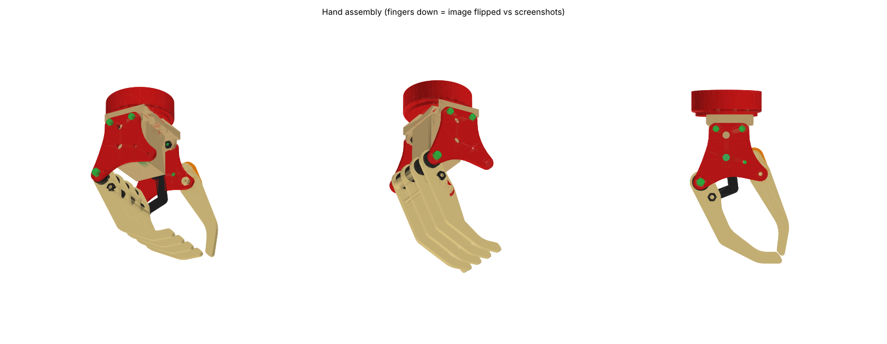
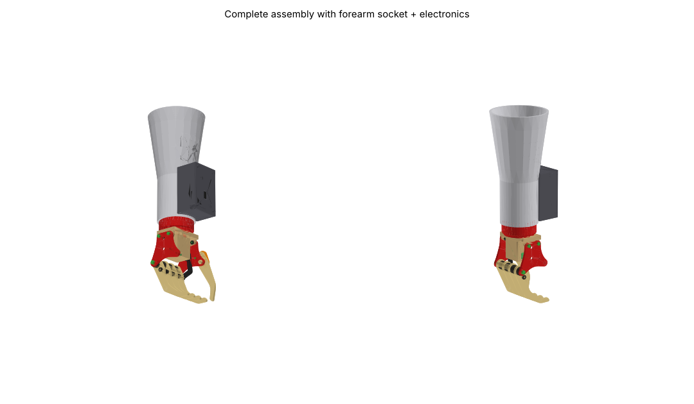

# Myoelectric prosthetic hand: complete parts set

This is a rebuild of `original/myoelectric hand buy.step` with every part in place.

The original STEP file held 5 components, and most of them were bare surfaces with no thickness: one finger, the thumb, one side plate, one tab and the wrist puck. The screenshots in `original/` show the full design: 4 sheet-metal fingers (钣金手指), a removable thumb (可拆卸拇指), an emergency-release pin (紧急释放开关), a motor (发动机), two side plates and a base bracket. This folder rebuilds the full design as solid, printable parts. They are built around the exact geometry of the original components.

## What is where

| Path | Contents |
|---|---|
| `cad/myoelectric_hand_complete.step` | Full assembly (60 parts, coloured, named). Open it in Fusion, SolidWorks or FreeCAD. |
| `stl_print_ready/` | **Files to slice.** One STL per unique printed part, already laid flat. The quantity is in the file name (`finger_x4.stl` means print 4). |
| `cad/parts_print_step_stl/` | Each printed part as STEP and STL, in assembly position. Use these for editing. |
| `cad/parts_hardware_reference/` | Bought parts (motor, screws, pins, electronics), for fit-checking only. **Do not print.** |
| `cad/print_list.json`, `cad/manifest.json` | Part sizes, volumes and validity flags. |
| `source/` | The CadQuery script that generates everything (`build.py`) and the checks (`check.py`, `motion.py`, `verify_orig.py`). |
| `original/` | Your original STEP file and screenshots, unchanged. |

Units are mm. In assembly coordinates, +Z points toward the forearm, so the fingers hang toward −Z. This is upside down compared with the screenshots. The hand is symmetric about the plane y = −23, which is the wrist axis.

## Which dimensions came from your file, and which are new

**Taken exactly from your STEP file (verified with a 0.000 mm difference):**
- **Finger** (Component75): the full outline, the Ø8 pivot hole at (−17.64, −17.15) and the Ø3 hole at (−9.87, −27.70). The plate is 3.0 mm thick, which the file shows directly through its 0.5 mm edge fillets.
- **Thumb** (Component77): the full outline and both Ø8 holes, at (23.87, −11.50) and (19.97, 0.97).
- **Side plate** (Component78): the full outline and all six holes. These are Ø2.9 at the finger pivot, the thumb pivot and the two tab screws, and Ø5.2 at (0, 0) and (0, 15.6).
- **Tab** (Component76): the outline and its two Ø2.7 holes. It is now part of the base bracket.
- **Wrist puck** (Component79): Ø50 × 14.7 mm with a 1.5 mm fillet, a Ø44 × 2.6 mm spigot, a Ø18.2 bore and a Ø1.5 hole.

**Assumed, because your file has no thickness information for these parts:**
- The side plate, tab and thumb are 3.0 mm thick, the same as the finger.
- The second side plate is a mirror of the first about y = −23. With four fingers spaced 13.33 mm apart, the spacing and the 3 mm side gaps come out equal.
- The thumb sits outside the front plate, between the plate and the orange rocker, as in your screenshots. In the STEP file it sat 10 mm further in, where it would hit finger 1.

**Designed new, to fit the original holes:**
- the base bracket and motor housing
- the pivot tube and spacers
- the coupling-rod spacers
- the crank and the dog-leg drive link
- the thumb rocker
- the forearm socket
- the electronics enclosure and lid

The forearm socket is a generic cone, Ø55 at the wrist and Ø84 at the top, 163 mm long. **It has to be re-shaped to fit the user's own limb before it is worn.**

## Holes added to original parts

Only two holes were added, and none was removed or moved:
- the side plate gets a Ø3.2 hole at (13, −3) for the release pin
- the wrist puck gets M3 pilot holes for the base and socket screws

## Read this before you print

1. **The original Ø2.9 holes are smaller than an M3 screw (3.0 mm).** These are the side-plate finger pivot, the thumb pivot and the tab-screw holes. I kept your size. After printing, drill them to Ø3.2 if you want a clearance fit, or leave them at Ø2.9 so the M3 screw self-taps.
2. On new holes I added 0.2 mm of radial clearance. On a well-calibrated printer, holes still print about 0.1–0.2 mm small. Run a reamer or drill bit through the pivot holes so the fingers swing freely.
3. Suggested settings are PETG or PLA+, 0.2 mm layers, 4 walls and 40 % infill. Print the fingers, side plates, thumb, rocker, crank and link at 100 % infill. The pivot tube is better made from an Ø8 aluminium rod, drilled and tapped M3 at both ends.
4. The STLs in `stl_print_ready/` are already oriented for printing. The base bracket prints with its top face on the bed, and the motor pocket bridges 12 mm. The enclosure prints with its open side down. The socket prints standing up.

## Parts list

**Printed parts** (`stl_print_ready/`):

| File | Qty | Note |
|---|---|---|
| finger_x4 | 4 | original outline |
| side_plate_x2 | 2 | original outline. Print 2 and flip one. |
| thumb_x1 | 1 | original outline |
| thumb_rocker_x1 | 1 | orange rocker; holds the thumb, pivot and release pin |
| base_bracket_with_motor_housing_x1 | 1 | the original tab mirrored on both sides, the base plate and the N20 housing |
| wrist_puck_x1 | 1 | original |
| finger_pivot_tube_x1 | 1 | or an Ø8 aluminium rod |
| pivot_spacer_between_fingers_x3, pivot_spacer_front_x1, pivot_spacer_back_x1 | 5 | |
| rod_spacer_x3 | 3 | |
| crank_arm_x1, drive_link_x1 | 1 each | |
| forearm_socket_x1 | 1 | adapt to the user |
| electronics_enclosure_x1, enclosure_lid_x1 | 1 each | |

**Hardware to buy:**

| Item | Qty | Where it goes |
|---|---|---|
| N20 gear motor, 6 V, about 50 rpm (1:298), Ø3 D-shaft × 10 mm | 1 | motor housing, coaxial with the plate hole at (0, 0) |
| M1.6 × 4 screws | 2 | motor face |
| M3 threaded rod, 52 mm | 1 | finger coupling rod, through the Ø3 hole in every finger |
| M3 nuts | 3 | 2 on the coupling rod, 1 on the thumb pivot |
| M3 × 8 socket-head screws | 6 | 2 hold the pivot tube to the plates, 4 hold the base to the puck |
| M3 × 10 socket-head screws | 3 | socket to puck |
| M3 × 14 screw | 1 | thumb pivot |
| M2.5 × 8 screws and nuts | 4 + 4 | tab to side plates |
| M2.5 × 8 screws | 4 | enclosure lid |
| Ø3 steel pin, cut to 3.6 mm | 1 | crank pin |
| Ø3 × 12 pull pin with head | 1 | emergency release (紧急释放开关) |
| Ø8 × 6 pin with a Ø10 head | 1 | thumb to rocker |
| MyoWare 2.0 EMG sensor and electrodes | 1 | pocket inside the socket |
| Arduino Nano, DRV8833 motor driver | 1 each | enclosure |
| 2S LiPo battery, about 50 × 30 × 10 mm, with a switch | 1 | enclosure. Limit the motor PWM to 80 % or less, because the N20 is rated 6 V. |

## How the hand moves

- **Fingers:** all four fingers turn on the Ø8 pivot tube. The M3 coupling rod and spacers lock them together.
- **Drive:** the N20 motor turns a 5 mm crank. A 34.4 mm dog-leg link joins the crank to the coupling rod at finger 1.
- **Range of motion:** one crank turn takes the fingers from your STEP pose (closed, tips touching the thumb) to 91° open and back.
- **Grip lock:** in the closed pose the crank is at dead-centre, so the grip holds without motor power.
- **Thumb:** the thumb is passive. It is pinned to the rocker, and the rocker pivots on the front plate. Pull the release pin and the thumb swings free.

## Checks run (all scripts in `source/`)

- All 60 parts are valid single solids, and all printed STLs are watertight.
- No parts overlap. The only overlaps are screws biting into their pilot holes, which is intended.
- **Motion check:** the drive was turned through a full crank revolution in 10° steps, moving the fingers, coupling rod, link and crank each time. Nothing collided at any step.
- Every original outline and hole was compared with your STEP file: the difference is 0.000 mm.

## Not tested

- Nothing has been printed. Check the fit of the first finger, side plate and pivot tube before printing the full set.
- The forearm socket is a placeholder shape. It needs fitting to the user's limb.
- Grip force depends on which N20 gear ratio you buy. A 1:298 ratio gives roughly 10–15 N at the fingertip.
- The EMG firmware isn't included.
